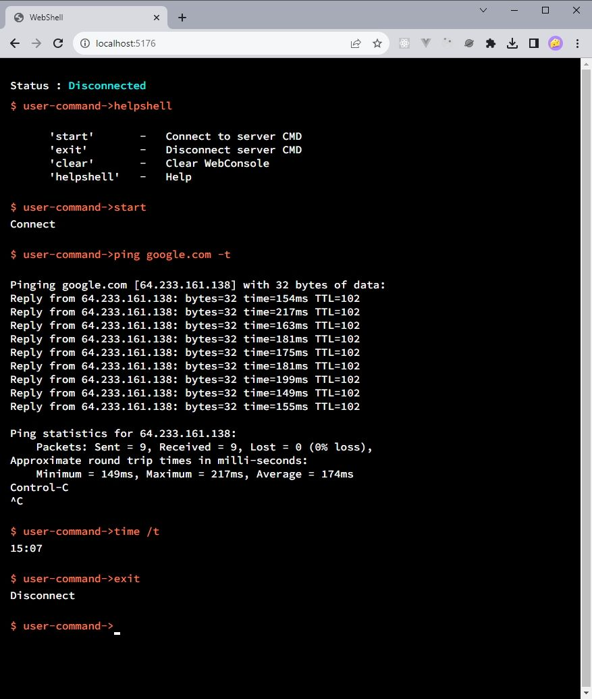

# Web-Shell

## Requirements
Web application with the functionality:

- Allows you to enter a console command in a text field on a web page and send it to the server for execution. The command must be executed in any shell of your choice that is in the system.
- Get the output of this command on the server (standard output or error output) and display it on a web page.
- Save the history of entered commands.Scroll through the history with the “up” and “down" keys

## Realization

### Stack
- C# .NET 7
- Windows cmd.exe
- WebSocket
- JS
### Backend

- Creates WebSocket connection
- Gets command from client 
- Launches a new console that processes the command
- Sends async result of the command, input blocking signal while the command is being executed and closes console
- Waits a new command, while the connection is open
- Sends `Ctrl+C` to child process to cancel command

### Frontend
- Client connects to the server via websocket
- Sends a command
- Gets result
- Implemented a custom caret and auto scroll using CSS and JS
- Save history on Session storage

## Run project

- Download repository
- Open project on your IDE
- Push the RUN button ▶
- Enter `helpshell` to get commands help 
- Enter command `start` to connect to the server
- Client connecting to server
- Enter standard commands, like `dir` or `ping`
- Push to ArrowUp or ArrowDown to select a command from history
- To finish work with web shell enter `exit`

### Internal commands:
| command     | description       |
|-------------|:------------------|
| `start`     | Connect to server |
| `exit`      | Disconnect server |
| `helpshell` | Help              |
| `clear`     | Clear web shell   |
